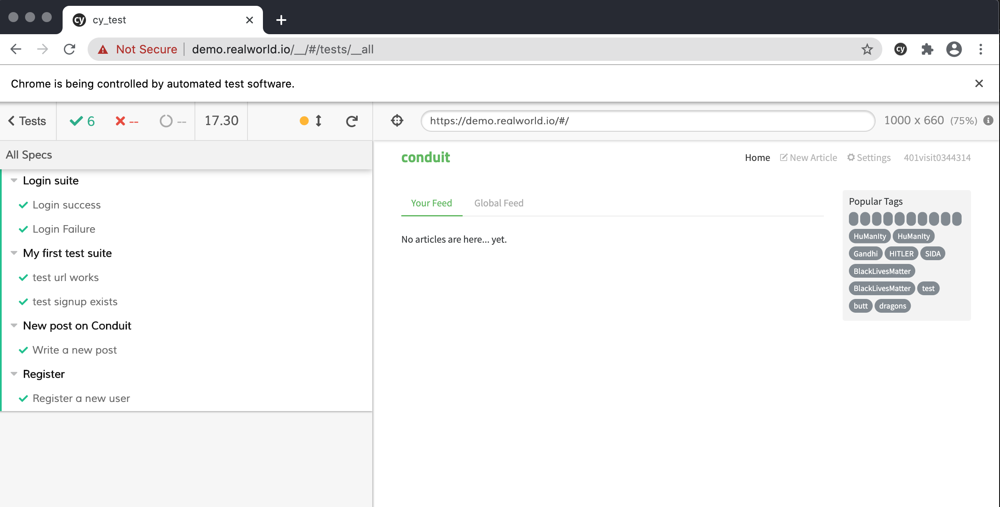
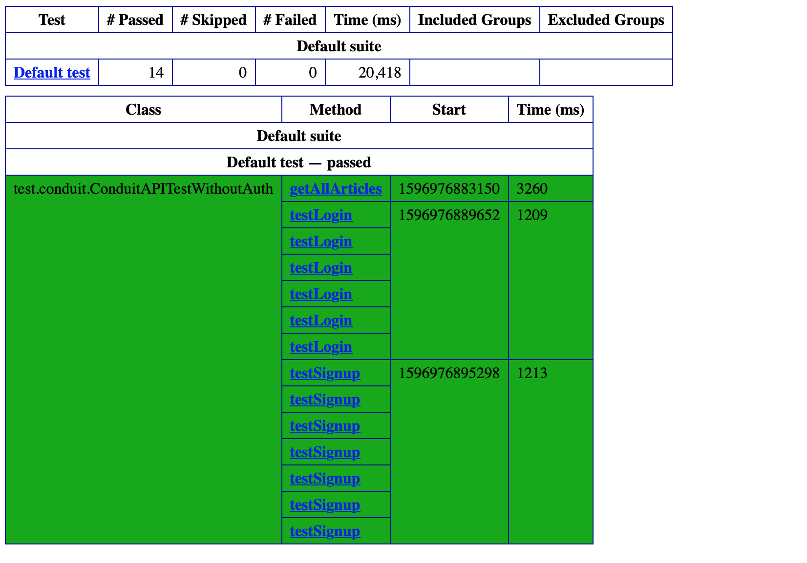
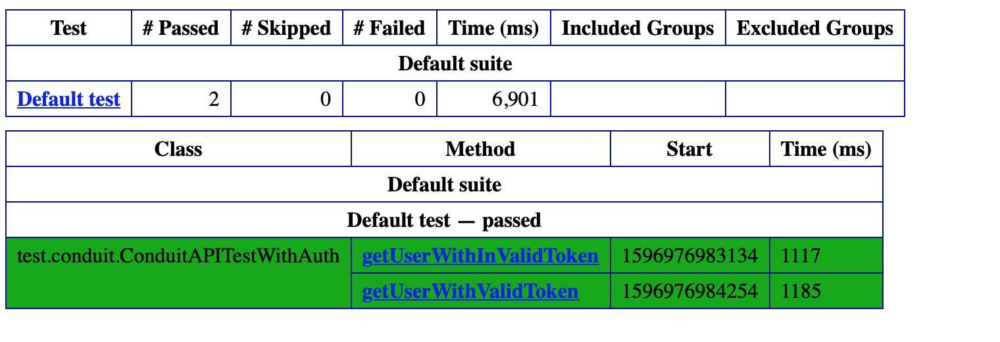

# Test Suite for Conduit app 

This repository contains test scripts for testing Conduit app using selenium and cypress.

## User interface testing
There are two sets of test suites available for UI testing
1) using Java, selenium, testng and maven (see conduit folder)
  * Key features: 
    * data driven approach in order to keep data separate from functional test logic and to aid with quick scaling
    * page object pattern to avoid tests being too sensitive to UI changes.
2) using Javascript and Cypress (see cy-test folder)

### Front end testcases covered
* Sign up of a new user
* User login
* Navigation to an article
* Creation of a new article

### API testing
API tests are built using Java and Rest Assured. 
Test cases covered
* Auth - token generation
* Get user with valid token
* Get user with invalid token
* User Signup (no auth required)
* User Login (no auth required)
* Get all articles 

###Installation/Pre-requisite
```
	Java 1.8 [Mandatory for selenium run]
	Maven 3.6.3 [Mandatory for selenium run]
	npm [Mandatory for cypress run]
```

### Run the test cases for selenium
```
sh selenium.sh
```
### Run the test cases for cypress
```
sh cypress.sh
```

### Selenium test run results


### Cypress test results



### API Test results




## Suggestions for quality

Relevance of API request/results
* Get articles for global feed has total count 500, but with offset greater than 500, still returns result.

Response issues
* My feed does not populate(https://conduit.productionready.io/api/articles/feed?limit=10&offset=0) - Bug

User Experience
* Logout is not accessible
* Multiple empty tags shown
* Global feed loading is slow
* Site is not mobile responsive
* some images missing

Security/Risks:
* Token generated doesn't expire.
* Api's work in http protocol


## Future Enhancements worth investing
- [ ] Convert to docker image(Add dockerfile with all installations software handled in it)
- [ ] Add docker build and run on environment as part of CI/CD
- [ ] Send test results in email/slack channel
